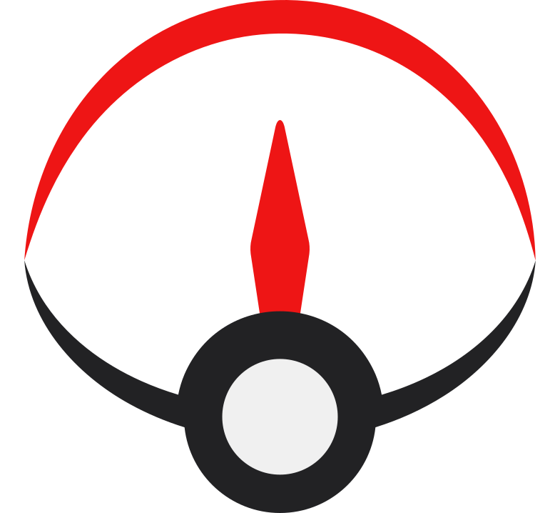

<h1 align="center">PokéDash</h1>

    

    <b>A web-based dashboard for <a href="https://github.com/40Cakes/pokebot-gen3">40Cake's PokeBotGen-3 project</a></b>
     
     
    Capable of hooking into multiple instances of PokeBots via their REST API to display their current status- such as the current party, recent encounters, and overall stats.
     

    
    

## ⬇️ **Installing**

-   Find builds [here](https://github.com/Dan-Mizu/PokeDash/releases), or spin up the dev environment detailed in the <b>Contribute</b> section.

### 🚧 Prerequisites

-   Requires [NodeJS](https://nodejs.org/en/learn/getting-started/how-to-install-nodejs)
-   Configured `obs.yml` to have a different port for each instance, and forwarded the ports if you wanted to use PokéDash externally.

### 💡 Tips

-   If using the dev environment, you can include default instances by providing a `.env` file. Check the `.env.example` file to get started.

## 🔠 **Languages**

-   [Typescript](https://www.typescriptlang.org/)

## 🏗️ **Frameworks**

-   [Vue 3](https://vuejs.org/)
-   [Nuxt 3](https://nuxt.com/)

## 🗳️ **Contribute**

The Typescript language is easy to develop with, as it is essentially Javascript with type-safety. This project uses the Vue javascript framework which is known to be one of, if not _THE_, easiest Javascript frameworks out there.

You can fork this repository, make changes, and then submit a pull request. Reach out to me on Discord (@DanMizu) if you are interested or have any questions.

1. **Install NPM or Bun and Visual Studio Code**

You can install NPM (Node Package Manager) from: <https://docs.npmjs.com/downloading-and-installing-node-js-and-npm>. The LTS is fine.

If on MacOS/Linux, the new Bun project promises faster package fetching and run times. You can learn how to install it here: <https://bun.sh/docs/installation>

Visual Studio Code is a great editor for web development and is obtained from: <https://code.visualstudio.com/>

You can use any other editor, though this project contains recommended settings and extensions for use in VSCode.

2. **Fork/Clone this Repo**

Theres a button for this at the top right of this repo. I personally use the Github Desktop app to fork and clone repos easily.

3. **Open the Repo in Visual Studio Code, Install Dependencies, and Run the Dev Server**

You can open the repo directly from Github Desktop after its been forked/cloned. If on VSCode, you can open an integrated terminal from the bottom of the window and run `npm install` or `bun install` to install the required packages, then run `npm run dev` or `bun dev` to start up the Nuxt dev server.

6. **Submit Changes For Review and Merging**

When you're finished implementing a new feature, push your changes (if you haven't forked yet, it will now prompt you to) then submit a pull request to the main repository. This process is detailed here: <https://github.com/firstcontributions/first-contributions>.

  If this helped you out, consider helping&nbsp;<i>me</i>&nbsp;out. :)

  

